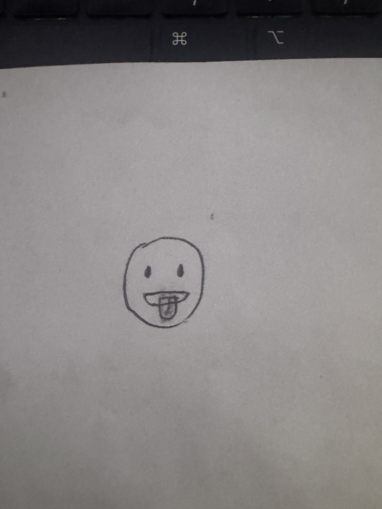
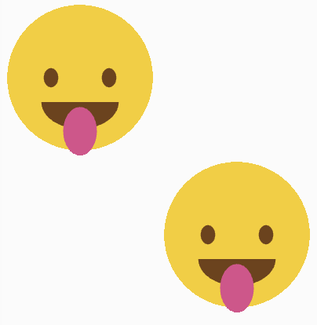
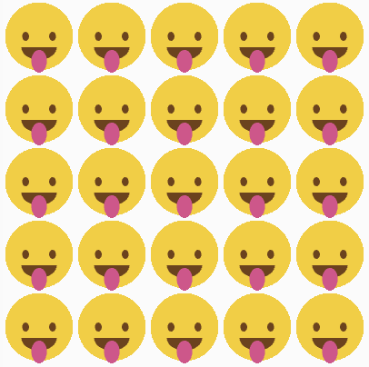
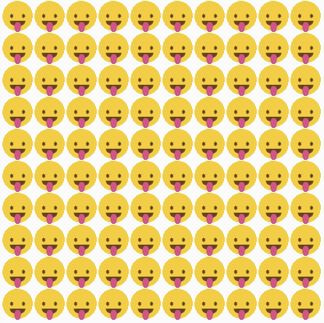
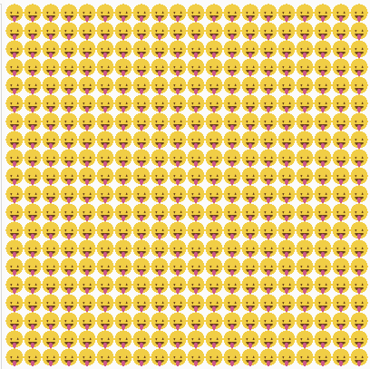

# Midterm
## Phase 1
I decided to go with the emoji with its' tongue sticking out. It's a pretty easy emoji to draw, uses very simple shapes, and wouldn't be too much trouble to put together in p5. 



## Phase 2
Phase 2 was very straightforward. First, I used the setup and draw functions from [our class repository](https://github.com/rdwrome/261sp26/tree/main/06Midterm#phase-2-translate-to-p5js-sketch). Then, I adjusted the dimensions so that the canvas would be 400x400 pixels. 

I would only be working with a couple of different shapes (mostly circles and ellipses). There were also very few individual pieces I needed to make, as I only needed a head, both eyes, a mouth, and a tongue. I made the head as large as the canvas, but with a little wiggle room for the tongue to be able to go past the chin. From there, I created the other shapes by first contouring the shape for each facial feature, positioning the object on the face, then grabbing the right color. 

The entire process of making the shapes and positioning them was just trial and error! Lots of testing out different coordinates, widths and lengths in order to get each facial feature just right.

I started with the the eyes, adjusting the shape and the positioning until I got the final result. Then, I got the RGB values of the Apple version of this emoji and applied said values to the eyes. I was left with this code:

```javascript
 fill(119, 64, 25);
 ellipse(126,200,37,49);
 ellipse(274,200,37,49);
```

I repeated this process for the tongue, just with different height/widt dimensions, colors, and coordinates. 

I had to do an arc shape for the mouth, which didn't give me too much trouble either. I used the same method as I had done with the previous shapes and ended up with this:

```javascript
 fill(119, 64, 25);
 ellipse(126,200,37,49);
 ellipse(274,200,37,49);
 **arc(200,262,197,136,0,PI);**
``` 

After that, I had the full object created! This was the final result:


## Phase 3

Phase 3 was very straightforward. I simply used the template from [our class repository](https://github.com/rdwrome/261sp26/tree/main/06Midterm#phase-3-function). After adding the push, pop, translate, and scale parameters, I copy/pasted my code from Phase 2 into the drawObject function. Then, I scaled the first emoji down to half its original size so that I could add another object. Finally, I copy/pasted the code from the first emoji and adjusted its positioning on the canvas until I was left with this:



## Phase 4 

I didn't know a great place to start Phase 4 at first. However, I figured I'd get going with the hint, and figure out how to use nested "for" loops in order to draw my object across the tiles.

I understood the first loop had to go through the x-axis, and that the second loop had to go through the y-axis. I figured it would be useful to look back in the nested for-loops section of [our class repository](https://github.com/rdwrome/261sp26/blob/main/04ControlFlow/codealong.js). The chessboard section had an accumulator for both columns and rows, so I used that code and flipped it around so that the x-axis would be affected first, then the y-axis. Inside of the second for-loop, I added the ```drawObject(x,y,s)``` code in order to print the object across the grid. I then took the advice of the hint, multiplying the width by the x parameter and the height by the y parameter of the function. 

Then, I started to make the grid. I defined the amount of columns and rows at the beginning of my code by setting them as variables, like this:

```javascript
let columns = 5
let rows = 5
```

I knew I'd have to adjust the scaling, so I decided to test out different scaling factors so that I could get the full 5x5 grid. However, I got an error when trying to run the code for the first time because of this code:

```javascript
function draw() {
  for (let x = 0; x < rows; x++) {
    for (let y = 0; y < cols; y++) {
          drawObject(x*(width), y*(height), s)
```

The error was that s wasn't defined, and I realized that the ```scale();``` parameter within ```drawObject``` was outside of the scope of the function. I remdied this by adding ```s``` as a variable immediately after the columns and rows, so the top of my code now looked like:

```javascript
let cols = 5
let rows = 5
let s = ??
```
After adjusting that s-value a couple of times, I realized I had ran into another error: my objects were printing in way too wide of a grid. At first I tried adjusting the scaling to a minute amount, but that didn't work. I ended up trying many different ways to lessen the distance, most of which involved adjusting how much x and y were being multiplied in the ```drawObject(x*(width), y*(height), s)``` function. I realized that x*width was almost always going to be more than 400 pixels, making the distance too wide. If I could shrink the amount of pixels down, I figured it would change. I decided to divide the width of the canvas by the amount of rows, and the height by the amount of columns. Here's the math:

x*(width/rows) = x*(400/5) = x*80

The whole size of the canvas is 400x400 pixels. If you divide both by 5, you are left with an 80x80 pixel grid that you are printing 5 times across and 5 times down. Adding this parameter to my code allowed the object to be shrunk and printed across the entire grid, tiling my object and making it a 5x5 grid! When the amount of rows and columns increases, the amount of pixels per tile decreases, allowing more objects to be printed.

When testing my code to see if it worked when I set the rows and columns to 10 and 20, I ran into a problem. My scaling factor was fixed at 0.2, which was causing issues. While the code would print a 10x10 and 20x20 grid, I wouldn't be able to see it because every tile was too large. I had to manually adjust the ```s``` variable for each grid, as well as the ```scale();``` parameter within the drawObject function, which wasn't super efficient.

In order to remedy this, I decided to have both the ```s``` variable and parameter respond to the number of rows and columns. All the user would have to do is input their number of desired rows and columns, and the scaling factor would automatically adjust. 

First, I figured out what s-value would make each grid appear properly.

```5x5: s = 0.2
10x10: s = 0.1
20x20: s = 0.05
```
Then, I tried to figure out the relationship between s, the rows and columns, and the canvas. I multiplied all of these numbers by 400 and got these results:

```0.05*400=20
0.1*400=10
0.2*400=5
```
In other words, the scale multiplied by the total width of the canvas equals the amount of rows and columns on the grid. However, I wanted the ```s``` variable to be defined. I switched the equation so that s was on its own and finally figured out the new variable:

```javascript
let s = rows/width
```
I added the following line of code within the ```drawObject``` function as well:

```javascript
function drawObject(x, y, s) {
	...
	**scale(s);**
	...;```

To test this code, I simply inputted 10 into every instance of ```rows```. Unfortunately... the code didn't work. I realized that I was using the scaling variable incorrectly. Instead of having the ```s``` be the scale number, I had to make it the size of a single visual object; 80x80 pixels for a single 5x5 tile, 40x40 pixels for a single 10x10 tile, and 20x20 pixels for a single 20x20 tile.

So, ```s``` became ```objectSize.``` This parameter could simply be calculated by dividing the total width of the canvas (400) by the number of rows and columns in the grid (5, 10, 20, etc.). So, I was left with:

```javascript
let objectSize = 400/cols```.

In order to let the user enter their desired grid size, I replaced the fixed let-statements... 

```javascript
let cols = 10
let rows = 10
let objectSize  = 400/cols
```
with a prompt for users to enter their desired grid size:

```javascript
let cols = prompt('Enter desired grid size.'), rows = cols
let objectSize  = 400/cols
```

Now, the scale number would only be used within the ```scale();``` parameter of the ```drawObject``` function. So,

 ```javascript
function drawObject(x, y, s) {
	...
	**scale(s);**
	...;
    }
```

became

```javascript
function drawObject(x, y, s) {
	...
	**scale(objectSize/400);**
	...;
	}
```

In the case of a 20x20 grid, objectSize would be 20, and 20/400 = 0.05, the s-variable that allows for a perfect 20x20 grid!

Now, I could input any number in the prompt and it would tile my object to that grid size perfectly. I had completed Phase 4!

Here are all of the grids mentioned in the assignment:








Here's my code in full:

```javascript
let cols = prompt('Enter desired grid size.'), rows = cols
let objectSize  = 400/cols
function setup() {
  createCanvas(400, 400);
  noStroke();
}
function drawObject(x, y, s) {
  push();
  translate(x, y);
  scale(objectSize/400);
  fill(255, 204, 51);
  circle(200, 200, 370); // Draw head
  fill(119, 64, 25);
  ellipse(126,200,38,50);
  ellipse(274,200,38,50);
  arc(200,260,195,138,0,PI); // Draw eyes/mouth
  fill(235,69,138);
  ellipse(200,336,86,123); // Draw tongue
  pop();
  }
function draw() {
  for (let x = 0; x < rows; x++) {
    for (let y = 0; y < cols; y++) {
      drawObject(x*(width/rows), y*(height/columns), objectSize);
    }
  }
}```
